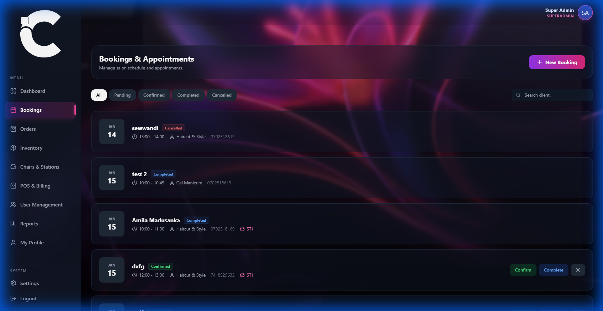
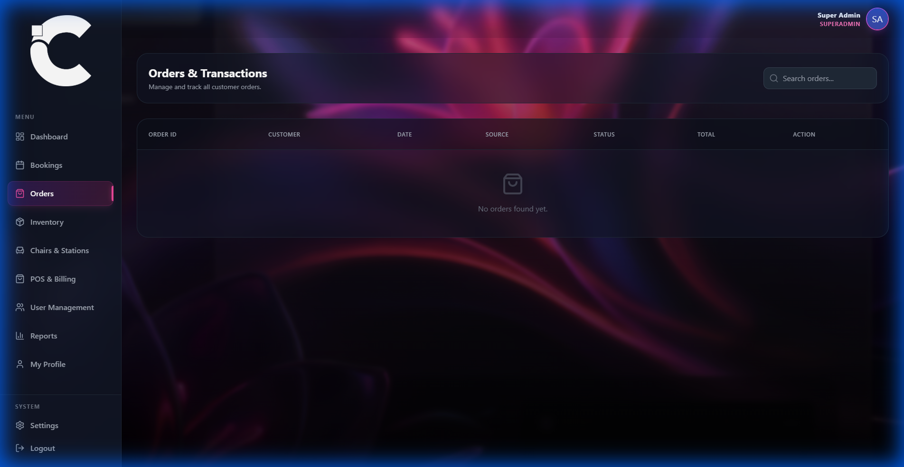
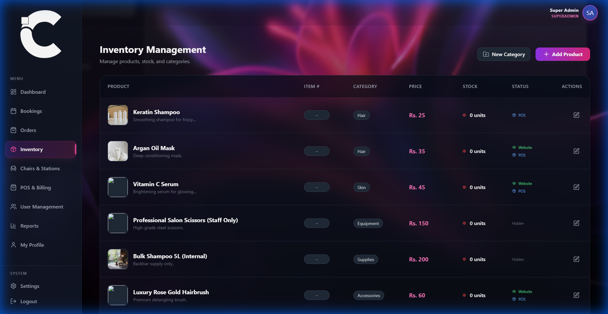
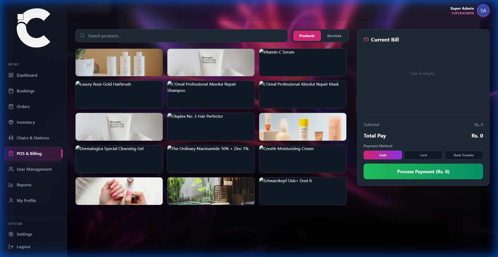
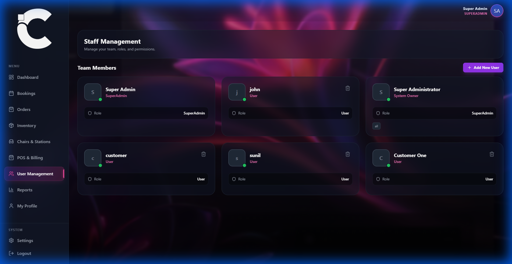
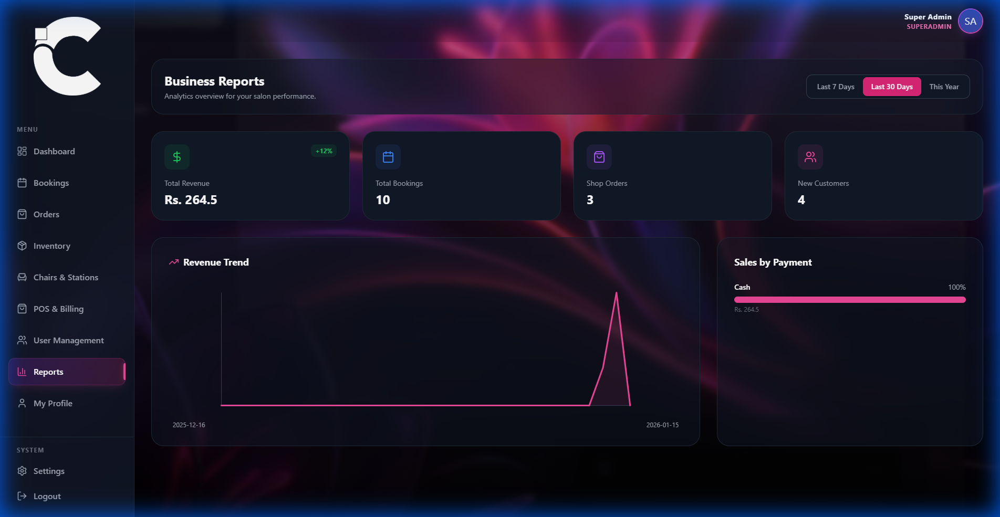

# Beautec Admin System Showcase

**Comprehensive Guide to the Admin Functionality**

---

## 📅 1. Smart Booking Management
Effortlessly manage appointments with our intuitive booking dashboard. View upcoming schedules, track status changes in real-time, and manage customer details at a glance.

---

## 🛒 2. Order Management
Streamline your e-commerce operations. Track online orders from placement to delivery, manage shipping statuses, and view customer purchase history seamlessly.

---

## 📦 3. Inventory Control
Keep track of stock levels with precision. Monitor product availability, manage categories, and ensure you never run out of essential salon supplies or retail products.

---

## 💳 4. Point of Sale (POS)
A modern, touch-friendly POS interface designed for speed. Process walk-in sales, add services to bills, and handle transactions quickly to keep the front desk moving.

---

## 👥 5. Staff & User Management
Manage your team effectively. Add new staff members, assign roles (Admin, Manager, Staff), and control access levels to secure your business data.

---

## 📊 6. Analytics & Reports
Make data-driven decisions. Visualize revenue trends, track top-selling services, and understand your business performance with comprehensive visual reports.

---

*Generated by Beautec AI Assistant*
